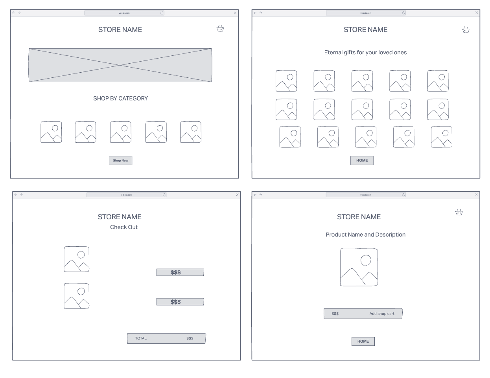
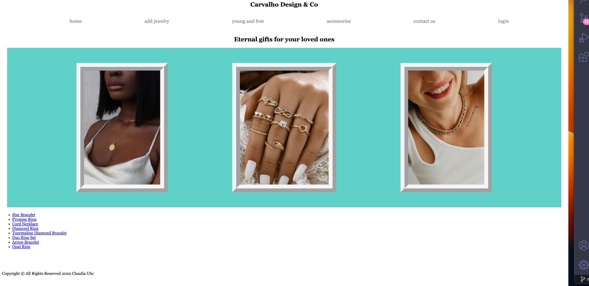

# Jewelry & Designs

## Description

A full CRUD web-based application for people show their jewelry/accessories design.

## Technologies Used

- HTMLL5
- Ejs
- CSS3
- JavaScript/Json
- Express
- Node.js
- MongoDB/Mongoose
- Git/GitHub

## Screenshots

## Getting started

[Click here](#) to visit the deployed app!

## Future Enhancements

- Have login/register page function
- Add authentication for security
- Have a drop menu to better navegation
- Have a page to review and chat with client
